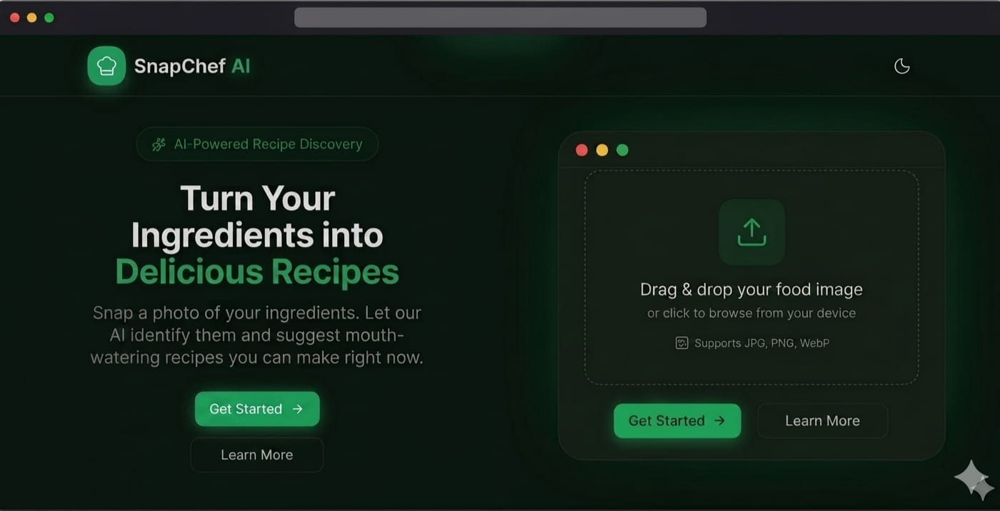
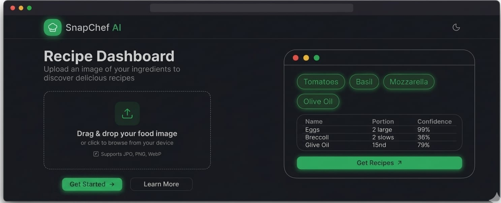
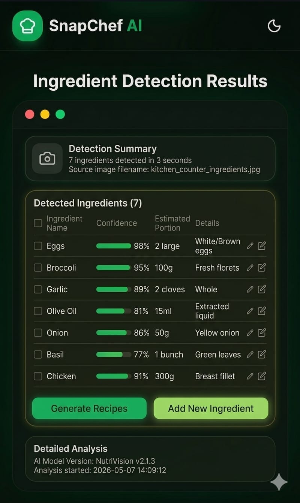
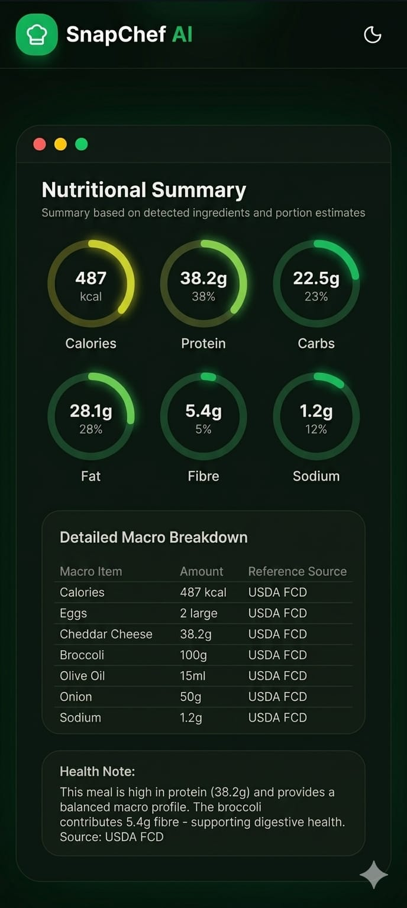
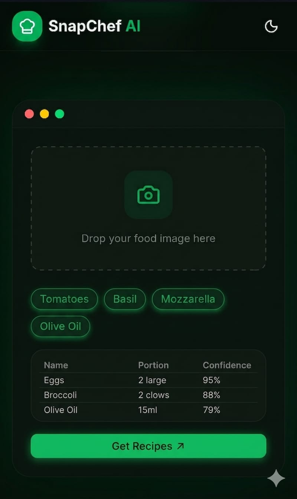

# 🍳 SnapChef AI

<div align="center">


### AI-Powered Ingredient Detection & Recipe Recommendation Platform

Upload a food image, detect ingredients using AI vision, analyze nutritional information, and generate personalized recipe suggestions instantly.

</div>

---

## 🚀 Live Demo

**Demo:** Coming Soon

**GitHub Repository:**
https://github.com/kishan-koli/Snapchef-ai

---

# 📖 Overview

SnapChef AI is a modern AI-powered web application that transforms ingredient images into actionable cooking insights.

Users can upload a photo of ingredients from their fridge, kitchen counter, or grocery basket. The application uses Google's Gemini Vision model to identify ingredients and generate recipe recommendations based on available items.

The platform also provides nutritional analysis and helps users discover new meal ideas without manually searching recipes.

---

# ✨ Features

### 🖼 AI Ingredient Detection
- Upload food or ingredient images
- AI-powered object recognition
- Ingredient confidence scores
- Portion estimation

### 🍽 Recipe Recommendation Engine
- Personalized recipe suggestions
- Recipe matching based on available ingredients
- Missing ingredient detection
- Recipe detail modal

### 🥗 Nutritional Analysis
- Calories estimation
- Protein analysis
- Carbohydrate tracking
- Fat breakdown
- Health insights

### 🛒 Smart Grocery Assistant
- Detect missing ingredients
- Auto-generate grocery checklist
- Ingredient management

### 🎨 Modern UI/UX
- Dark Mode Interface
- Mobile Responsive Design
- Smooth Animations
- Loading Skeletons
- Modern Glassmorphism Effects

---

# 📸 Screenshots

## Landing Page

<p align="center">
  
</p>

## Recipe Dashboard

<p align="center">
  
</p>

<!-- ## Ingredient Detection Results

<p align="center">
  
</p> -->

<!-- ## Nutrition Analysis

<p align="center">
  
</p> -->

## Mobile Responsive View

<p align="center">
  
</p>
---

# 🏗 System Architecture

```text
┌─────────────────────┐
│      User Upload    │
└──────────┬──────────┘
           │
           ▼
┌─────────────────────┐
│     Next.js UI      │
│  Upload Component   │
└──────────┬──────────┘
           │
           ▼
┌─────────────────────┐
│ API Route Handler   │
│ /api/analyze-image  │
└──────────┬──────────┘
           │
           ▼
┌─────────────────────┐
│   Gemini Vision AI  │
│ Ingredient Analysis │
└──────────┬──────────┘
           │
           ▼
┌─────────────────────┐
│ Ingredient Results  │
│ Confidence Scores   │
└──────────┬──────────┘
           │
           ▼
┌─────────────────────┐
│ Recipe Generator    │
│ Nutrition Engine    │
└──────────┬──────────┘
           │
           ▼
┌─────────────────────┐
│  Dashboard Results  │
└─────────────────────┘
```

---

# 🛠 Tech Stack

| Category | Technology |
|-----------|-----------|
| Frontend | Next.js |
| UI Library | React |
| Styling | Tailwind CSS |
| Icons | Lucide React |
| AI Model | Google Gemini |
| API Layer | Next.js API Routes |
| State Management | React Hooks |
| Notifications | Sonner |
| Deployment | Vercel |

---

# 📂 Project Structure

```bash
SnapChef-AI/
│
├── app/
│   ├── api/
│   │   ├── analyze-image/
│   │   └── get-recipes/
│   │
│   ├── dashboard/
│   └── page.jsx
│
├── components/
│   ├── upload-card.jsx
│   ├── recipe-card.jsx
│   ├── grocery-list.jsx
│   ├── ingredient-tags.jsx
│   └── navbar.jsx
│
├── lib/
│   ├── gemini.js
│   └── mock-data.js
│
├── public/
├── screenshots/
├── README.md
└── package.json
```

---

# ⚙️ Installation

### Clone Repository

```bash
git clone https://github.com/kishan-koli/Snapchef-ai.git
```

### Navigate Into Project

```bash
cd Snapchef-ai
```

### Install Dependencies

```bash
npm install
```

### Configure Environment Variables

Create:

```bash
.env.local
```

Add:

```env
GEMINI_API_KEY=your_api_key_here
```

### Run Development Server

```bash
npm run dev
```

Application runs at:

```text
http://localhost:3000
```

---

# 🔑 Environment Variables

| Variable | Description |
|-----------|-------------|
| GEMINI_API_KEY | Google Gemini API Key |

---

# 🎯 Future Enhancements

- User Authentication
- Save Favorite Recipes
- AI Meal Planning
- Weekly Nutrition Tracking
- Grocery Price Comparison
- Voice-Based Ingredient Input
- Barcode Scanner
- Multi-language Support

---

# 👨‍💻 Author

### Kishan Koli

Full Stack Developer | AI Enthusiast

GitHub:
https://github.com/kishan-koli

---

# ⭐ Support

If you found this project useful:

⭐ Star the repository

🍴 Fork the project

🛠 Contribute improvements

📢 Share with others

---

<div align="center">

### Built with ❤️ using Next.js and Gemini AI

</div>